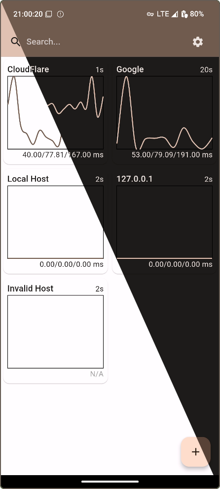

<h1 align='center'>
  PingUtility
</h1>

<p align='center'>
  small application to ping hosts
</p>

## Overview

PingUtility is a flutter application for monitoring ping responses.



## Build

This project is build with [flutter](https://flutter.dev/).
Use `flutter build bundle` in [src](./src) directory to create android apk file.

## Nix

This repository uses [devenv](https://github.com/cachix/devenv)
for managing development environments via [Nix](https://nixos.org/).

Type `devenv shell` in project root to enter the development environment,
or use [direnv](https://github.com/direnv/direnv) to automatically enter the environment.

Also configuration can be overridden via [devenv.local.nix](./devenv.local.nix) private configuration file.
Full devenv documentation can be found at https://devenv.sh/reference/options.

Example:

```nix
{lib, ...}: {
  android = {
    emulator.enable = false;
    # lib.mkForce used to override value from devenv.nix
    android-studio.enable = lib.mkForce false;
  };
}
```
